# Shadowy

## Introduction

A path tracing renderer using vulkan.

## Get Started

1. Install Vulkan >= 1.2 and make sure vulkan/Bin is in included in the path
2. Build with CMake, CMakeGUI or Other IDEs
3. Run Shadowy.exe

## Usage

### Camera Contorl

WASD to move, press Ctrl to move at a slower speed (0.1x).
Hold the left mouse button to rotate the camera.
You can also change the camera position/FOV in the UI panel.

### Run Shader Compile

Press the "Compile Ray Tracing Shaders" button or use the shortcut `CTRL + ALT + .`.

### Run Time Load Obj/Sky Texture

Press "Load Obj" or "Load Sky Texture" to open the file dialog.

### Light Control

Control the scene lights in the UI panel.

## Features

* RayTracing AO
* Path Tracing Microfacet Material
* Next Event Estimation
* PostProcess: ToneMapping

## Gallery

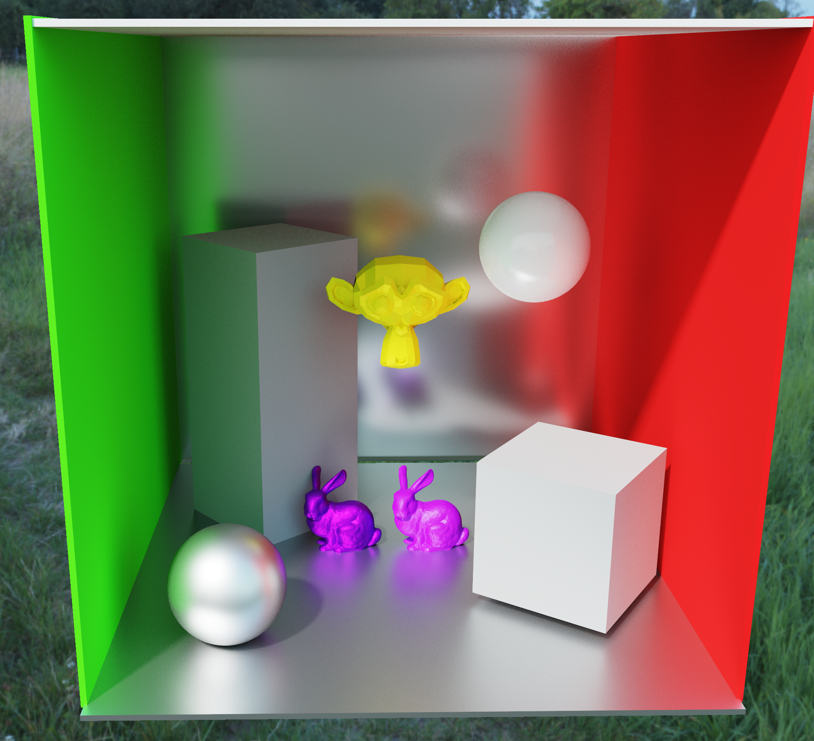

## Dev Log

> 2025.1.10:
>
> * RayTracing AO
>   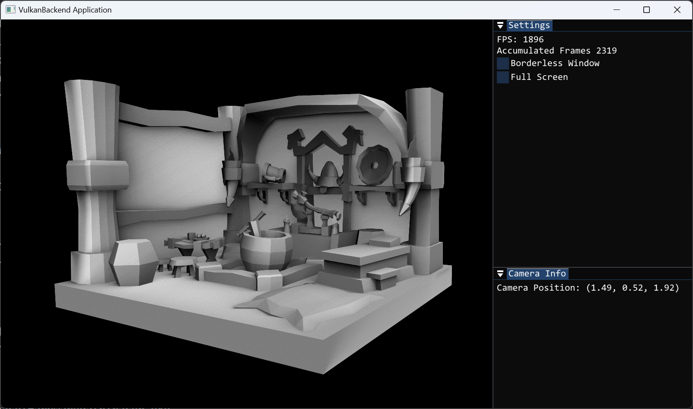

> 2025.1.11
>
> * Access Materials~~(issue with Access Textures, to fix)~~ in RayTracing Shaders

> 2025.1.13
>
> * Render SceneColor into Viewport Textures rather than SwapChain Images

> 2025.1.14: 
>
> * Add GBuffer Support

> 2025.1.15
>
> * Texture Support
>   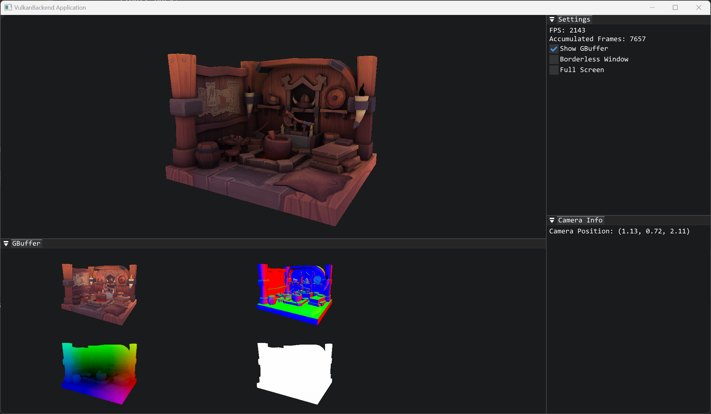
>
> * Refactor Material, Add PBR Parameters and Multi Mesh Texture Access

> 2025.1.16 
>
> * Access Lights In Shaders
> * Better Random In Shaders
> * Length Based AO and Render Options Control
> * Simple Path Tracing Algorithm
>
> 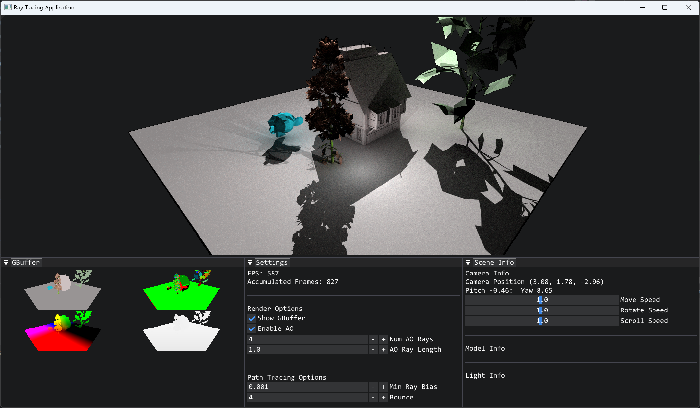
>
> 
>
> 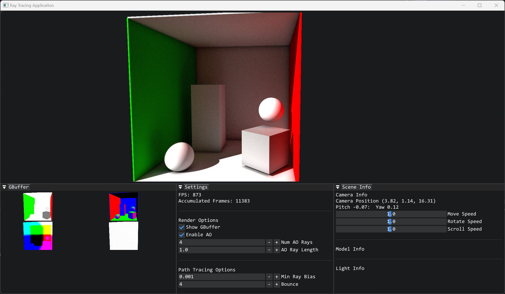
>
>   

>       <b>
>           Cornell Box
>       </b>
>   

>
> 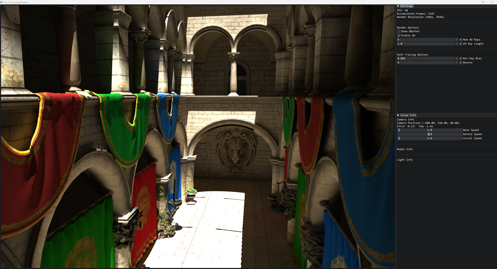
>
>   

>       <b>
>           Sponza
>       </b>
>   

> 2025.1.17
>
> * Add sky light and change sky light at runtime
>
> 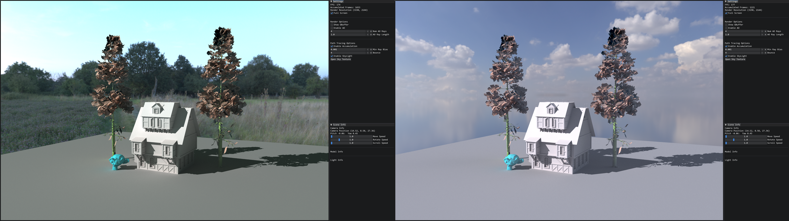
>
> 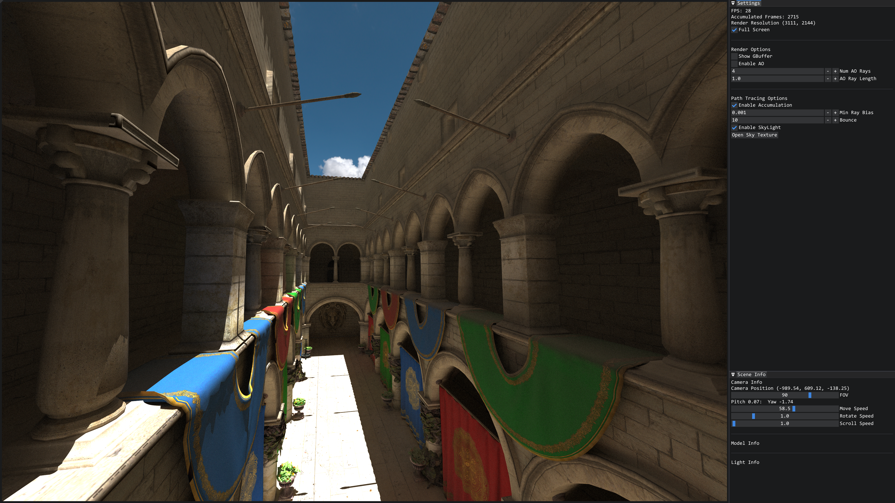

> 2025.1.18
>
> * UI control for camera and lights
> * PathTracing Developing
> * Open obj and compile shaders at runtime 
>
> 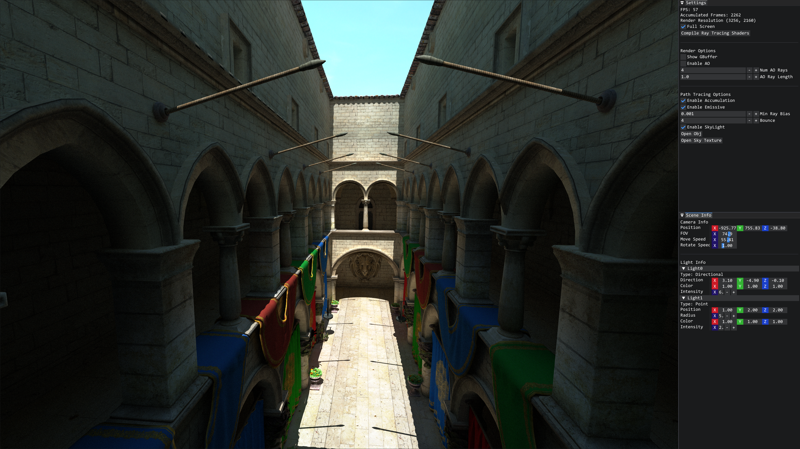

> 2025.1.20
>
> * Separate RenderOptions for each pass as push constants
> * Uncharted and ACES Tone Mapping(fixed sky texture isn't init with SRGB Format)
>   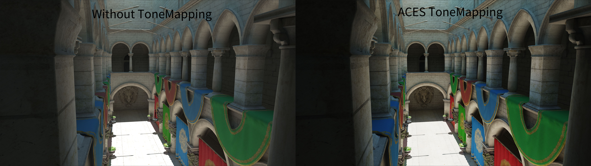
> * Microfacet Material + Next Event Estimation
>   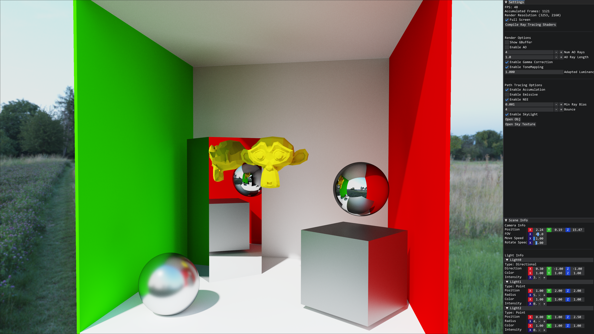

> 2025.1.21
>
> * Multi Importance Sampling
>   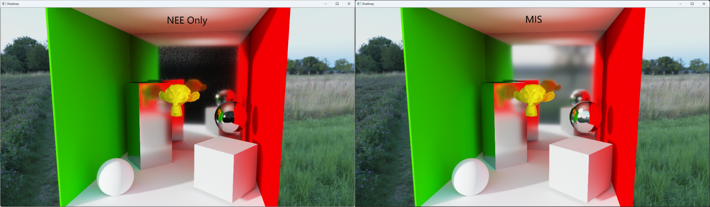

> 2025.1.22
>
> * Deferred Trace Material Ray(Defer Material Ray and Light Intersection to the next bounce).
>
> 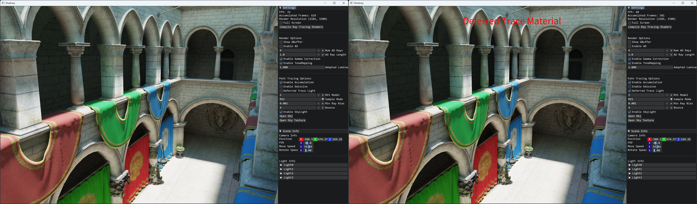
>
> 

>     <b>FPS 32 -> 48
>     </b>
> 

> 2025.2.4
>
> * Handle Mix Microfacet + DiffuseLambert Material