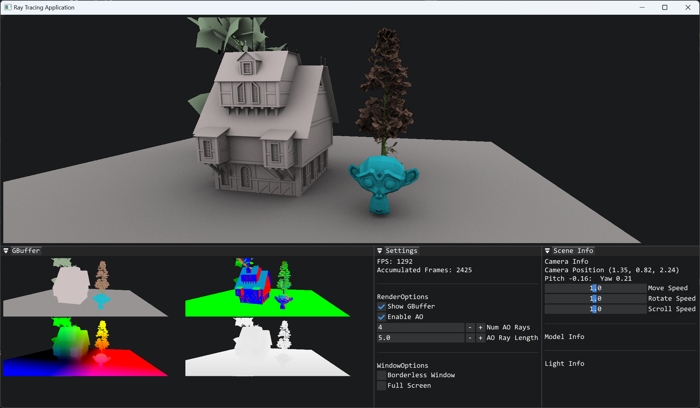

# HardwarePathTracer

HardwarePathTracer using Vulkan RayTracing API

## Dev Log

> 2025.1.10:
>
> * RayTracing AO
>   

> 2025.1.11
>
> * Access Materials~~(issue with Access Textures, to fix)~~ in RayTracing Shaders

> 2025.1.13
>
> * Render SceneColor into Viewport Textures rather than SwapChain Images

> 2025.1.14: 
>
> * Add GBuffer Support

> 2025.1.15
>
> * Texture Support
>   
>
> * Refactor Material, Add PBR Parameters and Multi Mesh Texture Access

> 2025.1.16 
>
> * Access Lights In Shaders
> * Better Random In Shaders
> * Length Based AO and Render Options Control
>   